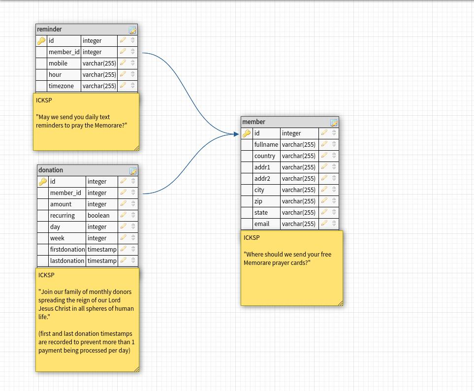

# payments

(server side)

- We store information on the api server before any payment is processed by the Client (member) and the payment system (Stripe).

- We collect/update information at each point (frame/view) in the application.

- When the Client (member) is asked for payment information, their "receipt" has already been printed. The button (Stripe element) that confirms their payment will display the amount being charged. If the amount being displayed doesn't match what the member agreed to, they will most likely not press it.
